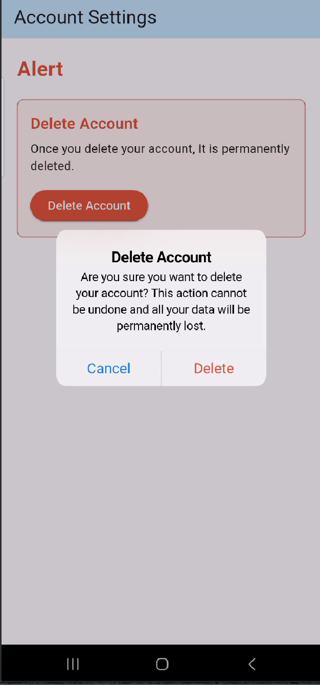

Cupertino AlertDialog is a widget that shows the user that they need to make an essential decision.

This app shows the use of Cupertino AlertDialog in an account setting where the user can delete their account.

How to run it:
git clone 
cd cupertiono_alertdialogue
Install the dependencies
Run the app using flutter run

Three Key Attributes of CupertinoAlertDialogue include:
Title - This is the bold message at the top. (Delete Account)
Content - It explains that deleting an account is permanent and that it cannot be undone once done. This helps the user understand the consequences before deleting their account.
Action - These are buttons at the bottom which include ‘cancel’ if they changed their mind and ‘delete’ if they still want to go through with it.

Screenshot of the final UI

I built the app using:
Flutter which is the UI framework
Cupertino AlertDialogue the IOS style alert dialog
Material Design for the basic app structure
Dart which is the programming language
